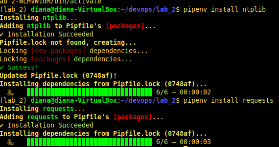

# Lab_2: Автоматизація. Знайомство з CI/CD.

1. Створила папку `lab_2`.
2. Інсталювала `pipenv` та створила ізольоване середовище для Python. Ознайомилась з командою `pipenv -h`.
3. Встановила бібліотеку `requests`, а також бібліотеку `ntplib`:

4. Створила файл `app.py`. Скопіювала код з репозиторію в створений файл. Ознайомилась з Python Tutorial.
5. Переконалась що програма працює:

6. Встановила бібліотеку `pytest`. Ознайомилась з документацією.
7. Запустила тести та переконалась, що вони працюють правильно.
8. Дописала функцію що перевіряє час доби та виводить привітання.
9. Написала тести для перевірки правильності виконання програми.
10. Перенаправила результати виконання тестів та програми у файл `results.txt`. Перенаправлення виводу у файл: `pipenv run pytest tests/tests.py > results.txt` та `pipenv run python app.py >> results.txt`.
11. Зробила коміт зі змінами.