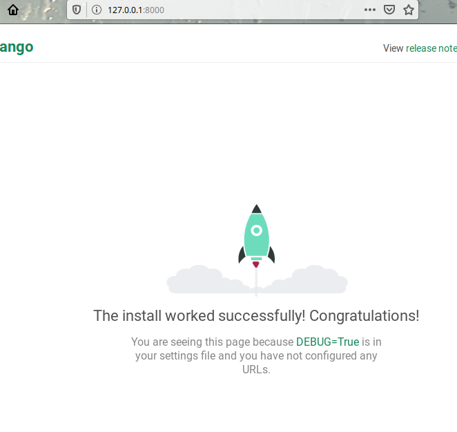

# Lab_3: Вступ до моніторингу.

1. Створила папку з лабораторною роботою `lab_3`. Ініціалізувала середовище `pipenv`, встановила необхідні пакети.
2. Створила заготовку за допомогою Django Framework.
3. Запустила проект:

4. Зупинила сервер. Створила коміт з базовим темплейтом. Виключила файл `db.sqlite3` з коміту додавши його у файл `.gitignore`.