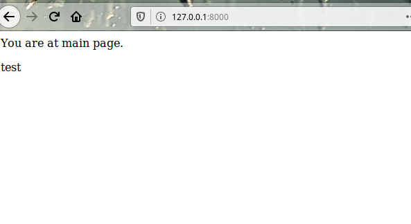
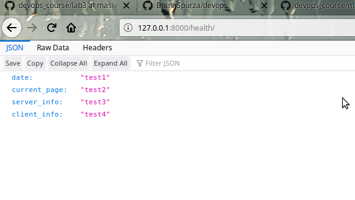

# Lab_3: Вступ до моніторингу.

1. Створила папку з лабораторною роботою `lab_3`. Ініціалізувала середовище `pipenv`, встановила необхідні пакети.
2. Створила заготовку за допомогою Django Framework.
3. Запустила проект:

4. Зупинила сервер. Створила коміт з базовим темплейтом. Виключила файл `db.sqlite3` з коміту додавши його у файл `.gitignore`.
5. Створила заготовку додатку.
6. Створила папку `main/templates` та додала туди файл `main.html`. Створила файл `main/urls.py`. Зробила коміт.
7. Вказала назву додатку для Django Framework. Відредагувала файл `my_site/settings.py`. Внесла зміни у файл `main/urls.py`
8. Ознайомилась з вмістом файлу `main/views.py`
9. Заповнила `main/urls.py` згідно зразка.
10. Запустила сервер. Сторінки доступні:

11. Встановила бібліотеку `requests`. Створила `monitoring.py` згідно зразку.
12. Відкрила сторінку та переконалась що все відображається.
13. Захист роботи:
- Модифікувала функцію `health`, щоб на сервері генерувалась відповідь з датою, URL сторінки, інформація про сервер, інформація про клієнта.
- Дописала функціонал для виведення повідомлення про недоступність сайту в програмі моніторингу. Використала `print` та `logging.error()` та `logging.warning()`
- Модифікувала `monitoring.py` щоб програма запускалась кожну хвилину та працювала у фоні
- Додала команду для швидкого виклику `pipenv run mon`
14. Запустила сервер та програму моніторингу одночасно. Зробила коміт файлу логів.