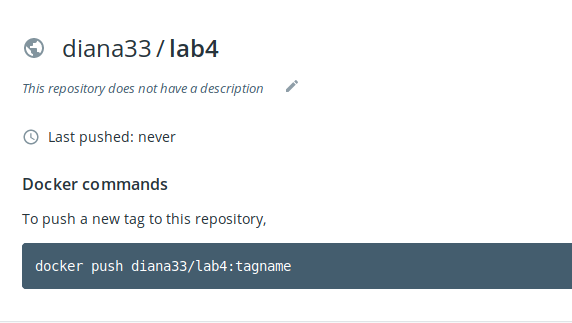
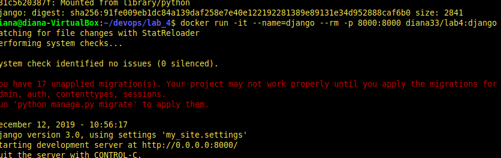

# Lab_4: Робота з Docker

1. Переглянула документацію Docker
2. Перенаправила вивід команд у файл `my_work.log`:

3. Ознайомилась з документацією
4. Завантажила базовий імедж `docker pull python:3.7-slim`. Створила файл `Dockerfile` та заповнила його за зразком. Ознайомилась з коментарями. Замінила посилання репозиторію на свій і зробила коміт.
5. Створила власний репозиторій на GitHub:

6. Виконала build та завантажила до репозиторію:

7. Запустила контейнер:

8. Завдання:
- Створила ще один `Dockerfile` для програми моніторингу
- Виконала build та дала тег `monitoring`
- Запустила обидва контейнери одночасно. Для моніторингу вказала ключ `--net=host`
- Перенесла файл `server.log` з контейнеру в папку з лабораторною. Для цього додала ключ `-v`
