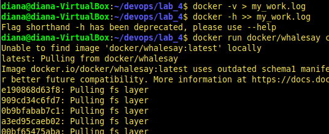

# Lab_4: Робота з Docker

1. Переглянула документацію Docker
2. Перенаправила вивід команд у файл `my_work.log`:

3. Ознайомилась з документацією
4. Завантажила базовий імедж `docker pull python:3.7-slim`. Створила файл `Dockerfile` та заповнила його за зразком. Ознайомилась з коментарями. Замінила посилання репозиторію на свій і зробила коміт.