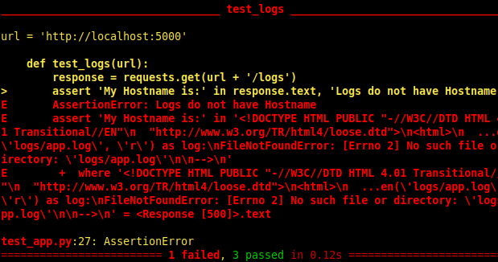
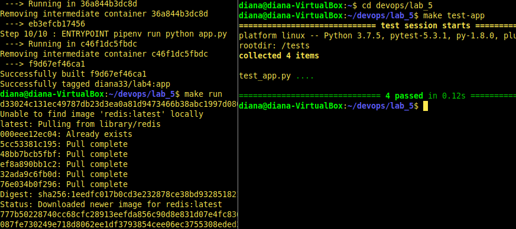
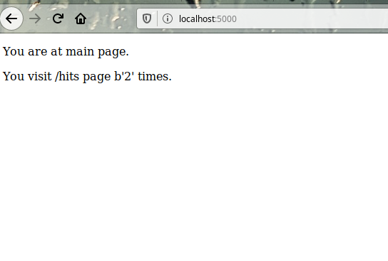
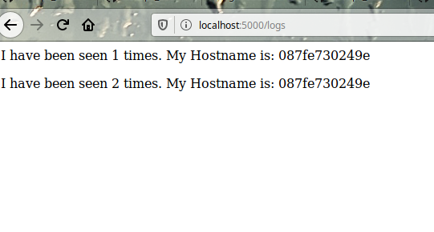
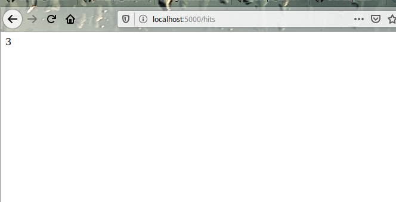

# Lab_5: Автоматизація за допомогою Makefile VS Docker Compose

1. Прочитала про Docker-compose
2. Прочитала про Flask
3. Автоматизація за допомогою `Makefile` або `docker-compose`
4. Варіант з `Makefile`
5. Створила папку `my_app` та папку `tests`. Скопіювала відповідні файли з репозиторію у ці папки. Ознайомилась зі вмістом. Щодо файлу `requirements.txt` - цей файл містить залежності: `redis, flask` - для `my_app` та `requests, pytest` - для `tests`.
6. Запустила додаток, а потім тести. 3 тести пройшли успішно, а один ні:

7. Видалила файли, створені у результаті тестового запуску. Створила два `Dockerfile` та один `Makefile` за зразком.
8. Ознайомилась з вмістом файлів. Розписую значення директив `Makefile`:
  1. `STATES := app tests` - змінна містить назви цілей
  2. `REPO := ..` - назва репозиторію
  3. `.PHONY $(STATES)` - вказуємо що цілі не є файлами
  4. `$(STATES):...` - визначаємо команди які необхідно виконати для цілей `app` або `tests`. В даному випадку створюється docker image для кожної цілі.
  5. `run:..` - Ціль для запуску контейнерів необхідних для роботи додатку `app` та створення мережі.
  6. `test-app:..` - Запуск контейнеру з тестами
  7. `docker-prune` - очищення ресурсів.
 9. Створила імеджі для app та tests. Запустила у двох різних вкладках. Зробила скріни:
 
 
 
 
 10. Зупинила проект та почистила ресурси директивою Makefile.
 11. Створила директиву для завантаження імеджів.
 12. Видалила створені та закачані імеджі. Створила для цього директиву Makefile
 13. Створила файл `docker-compose.yml` та заповнила його вмістом. Дві мережі потрібно щоб можна було ізолювати доступ контейнерів до конкретної мережі. 
 14. Запустила docker-compose
 15. Потрібно зайти на `localhost:80`
 16. Імеджі мають теги: `bobas/lab4-examples:compose-tests` та `bobas/lab4-examples:compose-app`. Замінила їх на власні та перезапустила docker-compose.
 17. Зупинила проект та почистила ресурси.
 18. Завантажила імеджі.
 19. На мою думку і те і те є зручним для автоматизації подібних задач. Але все ж таки docker-compose призначений для роботи з контейнерами, тому більш розумно буде використовувати саме його для автоматизації розгортки контейнерів. А Makefile підходить для всіх випадків.
 20. Створила такий самий файл для попередньої лабораторної роботи.